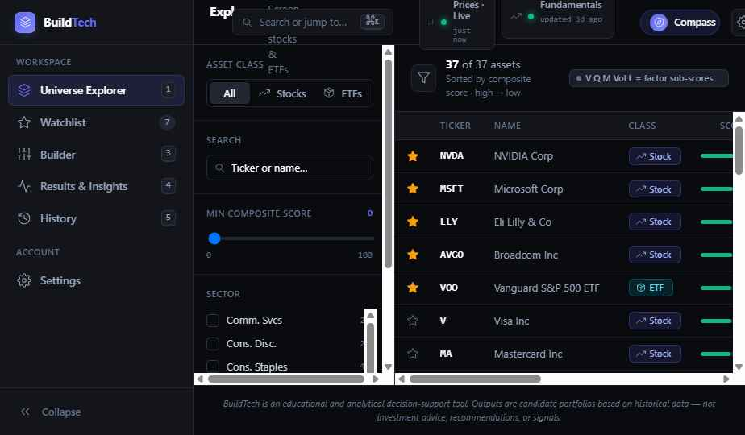
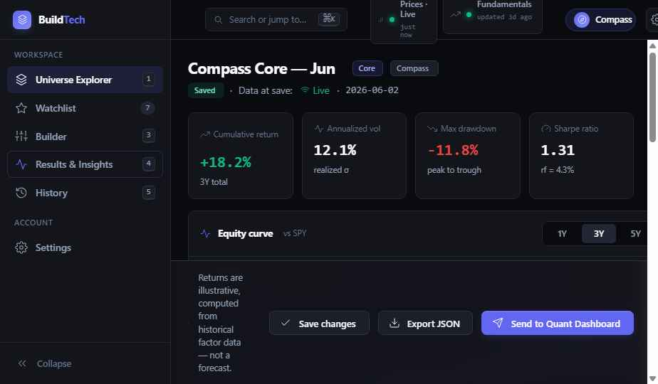

# BuildTech

Local-first portfolio construction assistant with a scored asset universe,
correlation-aware candidate portfolios, FastAPI backend, React frontend, and
SQLite persistence.

[](https://fastapi.tiangolo.com)
[](https://react.dev)
[](https://sqlite.org)
[](https://pytest.org)
[](LICENSE)

## 30-Second Scan

| Area | What this project shows |
|---|---|
| Product | Single-user portfolio construction workflow from risk profile to candidate allocations |
| Finance | Scored stock/ETF universe, watchlist input, correlation-aware selection, risk parity allocation, historical analytics |
| Engineering | FastAPI, SQLAlchemy 2.0, Alembic, SQLite, React 18, TypeScript, Vite, Tailwind |
| Reliability | Local-first design, frozen snapshots, read-only analytics endpoint, JSON export schema, backend test suite |
| Portfolio value | Demonstrates finance domain modeling, API design, typed frontend work, and non-advisory product language |

> Educational analytics only. BuildTech does not provide investment advice,
> trading signals, robo-advice, or financial recommendations.

## Preview

| Universe | Results |
|---|---|
|  |  |

## Core Workflow

1. Complete an 8-question risk questionnaire or use the risk slider override.
2. Explore a scored universe of US stocks and ETFs.
3. Build an optional watchlist for candidate filtering.
4. Generate Core, Growth Tilt, and Defensive Tilt candidate portfolios.
5. Review allocation, construction log, historical analytics, and SPY overlay.
6. Save, archive, or export portfolios as versioned JSON.

## Technical Highlights

- FastAPI backend with SQLAlchemy 2.0 ORM models and Alembic migration support.
- Three-tier price resolver: SQLite cache, frozen Parquet snapshot, and script-only `yfinance` refresh.
- Correlation-aware construction with relaxation passes and equal-weight fallback.
- Risk parity allocation with risk-level constraints.
- Read-only analytics endpoint that avoids live fetches and avoids DB writes.
- Forecasting-language pre-commit hook to keep advisory claims out of the project.
- React/Vite frontend with TypeScript, Tailwind, and production build checks.

## Local Setup

### Backend

```bash
cd backend
python -m venv .venv
source .venv/bin/activate
pip install -r requirements.txt
alembic upgrade head
uvicorn app.main:app --reload
```

On Windows PowerShell, activate with:

```powershell
.\.venv\Scripts\Activate.ps1
```

### Frontend

```bash
cd frontend
npm install
npm run dev
```

### Docker

```bash
docker compose up --build
```

## Validation

```bash
cd backend
pytest

cd ../frontend
npm run typecheck
npm run build
```

## Documentation

- [Architecture](docs/ARCHITECTURE.md)
- [Release notes](RELEASE_NOTES_v1.0.md)
- [Project plan](BuildTech_Project_Plan_v4.md)

## License

MIT License. See [LICENSE](LICENSE).
